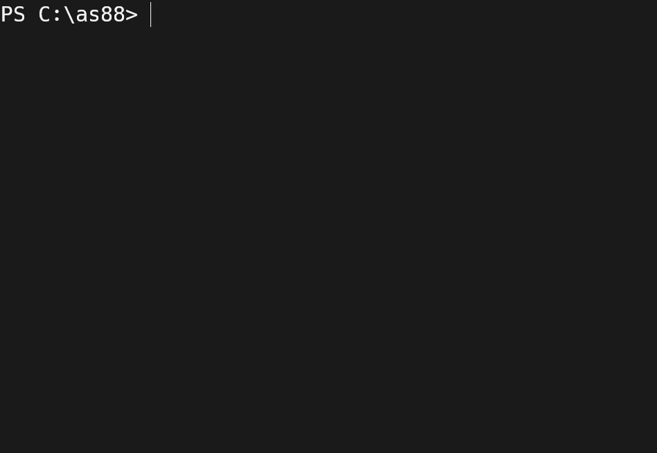

# as88++

An attempt to reimplement Intel 8088 assembler + emulator [used in my university](https://github.com/StoDevX/as88).



### Quickstart

🚧 Highly unstable. Only a small subset of instructions is currently implemented. 🚧

Uses zig 13.

```
zig build -Doptimize=ReleaseSmall
./zig-out/bin/t88 examples/demo.s
```
